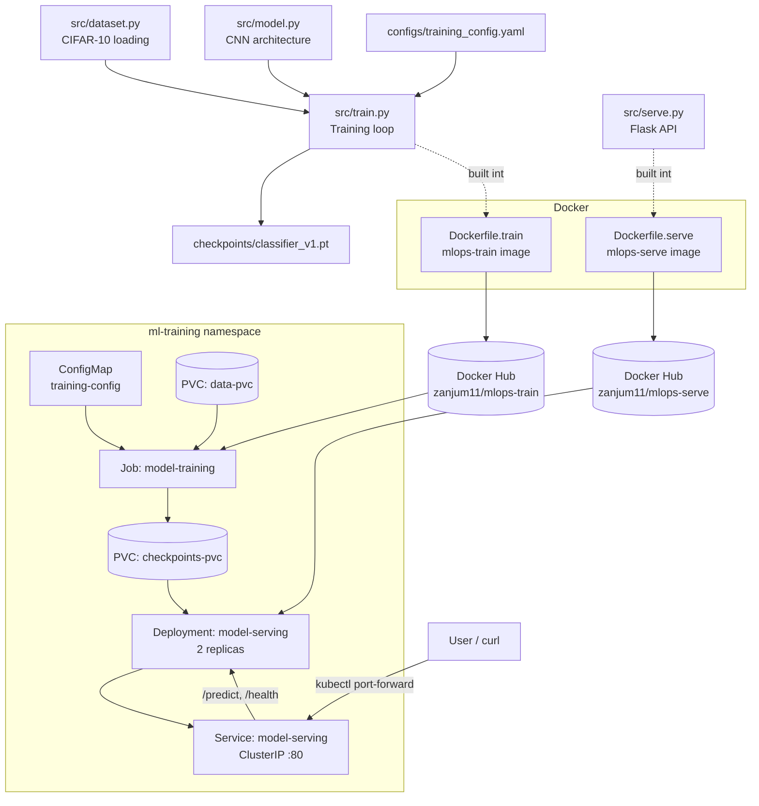

# MLOps PyTorch Pipeline

A PyTorch image classification model (CIFAR-10), taken through the full deployment
lifecycle: local development → containerized training with Docker → orchestrated
training and serving on Kubernetes.

## Architecture



**Flow summary:**
1. A CNN model (`model.py`) is trained on CIFAR-10 (`dataset.py`, `train.py`), driven by `training_config.yaml`, producing a checkpoint.
2. The training code and a Flask serving API (`serve.py`) are each packaged into separate, purpose-built Docker images (multi-stage builds, CPU-only PyTorch).
3. Both images are pushed to Docker Hub so the Kubernetes cluster can pull them.
4. In Kubernetes: a **Job** runs training once (reading config from a ConfigMap, reading/writing data and checkpoints via PersistentVolumeClaims). A **Deployment** runs 2 replicas of the serving API (mounting the checkpoint PVC read-only), fronted by a **Service** for stable access, with liveness/readiness health checks and a zero-downtime rolling update strategy.

## Repository Structure

```
mlops-pytorch-pipeline/
├── src/                    # Model, dataset, training loop, Flask serving API
├── configs/                # Training hyperparameters (YAML)
├── docker/                 # Dockerfile.train, Dockerfile.serve
├── requirements/           # Pinned dependencies (train.txt, serve.txt)
├── k8s/                    # Kubernetes manifests (namespace, ConfigMap, PVCs,
│                             training Job, serving Deployment/Service,
│                             GPU bonus Job variant)
└── tests/                  # Unit tests
```

## Setup Instructions

### Prerequisites
- Python 3.10+
- Docker Desktop (with Kubernetes enabled, or access to any Kubernetes cluster)
- `kubectl`
- A Docker Hub account (for pushing images so your cluster can pull them)

### 1. Clone and set up the environment
```bash
git clone https://github.com/zebaanjum79-boop/mlops-pytorch-pipeline.git
cd mlops-pytorch-pipeline
python -m venv venv
source venv/Scripts/activate   # Windows Git Bash; use venv/bin/activate on Mac/Linux
pip install torch torchvision pyyaml flask pillow
```

### 2. Train and serve locally (no Docker/K8s)
```bash
python src/train.py          # run from project root
python src/serve.py          # in a separate terminal, after training produces a checkpoint
curl http://localhost:8080/health
curl -X POST http://localhost:8080/predict -F "image=@path/to/image.png"
```

### 3. Build and run with Docker
```bash
docker build -f docker/Dockerfile.train -t mlops-train:v1 .
docker build -f docker/Dockerfile.serve -t mlops-serve:v1 .

docker run --rm -v $(pwd)/data:/app/data -v $(pwd)/checkpoints:/app/checkpoints mlops-train:v1
docker run --rm -p 8080:8080 -v $(pwd)/checkpoints:/app/checkpoints mlops-serve:v1
```

### 4. Push images to a registry (required for Kubernetes to pull them)
```bash
docker tag mlops-train:v1 <your-dockerhub-username>/mlops-train:v1
docker tag mlops-serve:v1 <your-dockerhub-username>/mlops-serve:v1
docker push <your-dockerhub-username>/mlops-train:v1
docker push <your-dockerhub-username>/mlops-serve:v1
```
Update the `image:` field in `k8s/training-job.yaml` and `k8s/serving-deployment.yaml` to match your Docker Hub username.

### 5. Deploy to Kubernetes
```bash
kubectl apply -f k8s/namespace.yaml
kubectl apply -f k8s/configmap.yaml
kubectl apply -f k8s/pvc.yaml
kubectl apply -f k8s/training-job.yaml

# once the Job completes:
kubectl apply -f k8s/serving-deployment.yaml
kubectl apply -f k8s/serving-service.yaml

kubectl get pods -n ml-training
kubectl port-forward svc/model-serving 8080:80 -n ml-training
curl -X POST http://localhost:8080/predict -F "image=@path/to/image.png"
```

### Optional: GPU training
`k8s/training-job-gpu.yaml` is a GPU-enabled variant of the training Job (requests `nvidia.com/gpu: 1`, uses a `nodeSelector` and toleration for GPU-tainted nodes). It is not applied in this setup since no GPU node is available locally; it's included as a bonus manifest.

## Results
Final training run (10 epochs, CPU): **77.86% validation accuracy**, `best_val_loss: 0.6269`.